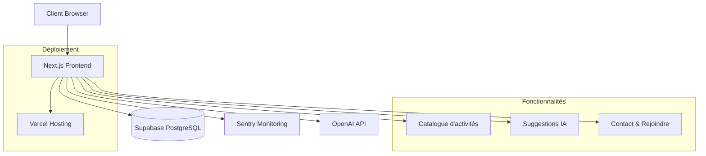

# La Vida Luca - Documentation

## Vue d'ensemble

La Vida Luca est une plateforme collaborative dédiée à la formation des jeunes en MFR (Maisons
Familiales Rurales) et au développement d'une agriculture nouvelle. Cette documentation couvre
l'architecture technique, le déploiement et l'utilisation de la plateforme.

## Architecture

### Composants

- **Frontend**: Next.js + React + TypeScript
- **Base de données**: PostgreSQL (Supabase)
- **Authentification**: JWT via Supabase
- **Déploiement**: Vercel (frontend)
- **Monitoring**: Sentry (erreurs) + métriques personnalisées

### Schéma d'architecture



## Installation

### Prérequis

- Node.js 18.x ou supérieur
- npm ou yarn
- Git

### 1. Cloner le repository

```bash
git clone https://github.com/vidaluca77-cloud/LaVidaLuca-App.git
cd LaVidaLuca-App
```

### 2. Installation des dépendances

```bash
npm install
```

### 3. Configuration de l'environnement

Créer un fichier `.env.local` avec les variables suivantes :

```env
# Supabase
NEXT_PUBLIC_SUPABASE_URL=votre_url_supabase
NEXT_PUBLIC_SUPABASE_ANON_KEY=votre_clé_supabase

# OpenAI (pour les suggestions IA)
OPENAI_API_KEY=votre_clé_openai

# Sentry (monitoring)
NEXT_PUBLIC_SENTRY_DSN=votre_dsn_sentry

# Contact
NEXT_PUBLIC_CONTACT_EMAIL=contact@lavidaluca.fr
NEXT_PUBLIC_CONTACT_PHONE=+33123456789
```

### 4. Lancement en développement

```bash
npm run dev
```

L'application sera accessible sur `http://localhost:3000`

## Scripts disponibles

| Script               | Description                                         |
| -------------------- | --------------------------------------------------- |
| `npm run dev`        | Lance le serveur de développement                   |
| `npm run build`      | Compile l'application pour la production            |
| `npm run start`      | Lance l'application compilée                        |
| `npm run lint`       | Vérifie la qualité du code avec ESLint             |
| `npm run lint:fix`   | Corrige automatiquement les erreurs ESLint         |
| `npm run format`     | Formate le code avec Prettier                      |
| `npm run format:check` | Vérifie le formatage du code                     |
| `npm run type-check` | Vérifie les types TypeScript                       |
| `npm run test`       | Lance tous les tests                               |
| `npm run test:coverage` | Lance les tests avec couverture de code        |
| `npm run test:watch` | Lance les tests en mode watch                     |
| `npm run test:ui`    | Lance uniquement les tests des composants UI       |
| `npm run quality`    | Lance toutes les vérifications (types, lint, format, tests) |

## Structure du projet

```
├── public/                 # Fichiers statiques
│   ├── icons/             # Icônes PWA
│   └── manifest.webmanifest
├── src/
│   ├── app/               # App Router Next.js 15+
│   │   ├── api/           # Routes API
│   │   ├── catalogue/     # Page catalogue d'activités
│   │   ├── contact/       # Page contact
│   │   ├── rejoindre/     # Page rejoindre
│   │   ├── layout.tsx     # Layout principal
│   │   └── page.tsx       # Page d'accueil
│   ├── components/        # Composants réutilisables
│   │   ├── ui/           # Composants UI de base (Button, Card, Badge)
│   │   ├── layout/       # Composants de mise en page (Header, Footer)
│   │   └── common/       # Composants communs
│   ├── hooks/            # Hooks React personnalisés
│   ├── lib/              # Utilitaires et configurations
│   ├── styles/           # Styles globaux et utilitaires CSS
│   ├── types/            # Types TypeScript
│   └── monitoring/       # Outils de monitoring
├── tests/                # Tests d'intégration
└── docs/                 # Documentation additionnelle
```

## Déploiement

### Production sur Vercel

1. **Connexion du repository**
   - Connecter le repository GitHub à Vercel
   - Sélectionner la branche `main` pour les déploiements automatiques

2. **Configuration des variables d'environnement** Dans le dashboard Vercel, ajouter toutes les
   variables du fichier `.env.local`

3. **Déploiement**

   ```bash
   # Déploiement automatique via Git
   git push origin main

   # Ou déploiement manuel via CLI
   npx vercel --prod
   ```

### Optimisations de production

- **Compression** : Gzip automatique
- **Images** : Optimisation via Next.js
- **Fonts** : Optimisation automatique des Google Fonts
- **Bundle** : Tree-shaking et minification
- **PWA** : Manifest et service worker

## Monitoring et Observabilité

### Sentry (Monitoring d'erreurs)

- Capture automatique des erreurs frontend
- Monitoring des performances
- Alertes en temps réel
- Session Replay pour le debugging

### Métriques personnalisées

- Temps de chargement des pages
- Interactions utilisateur
- Erreurs API
- Performances des suggestions IA

### Logs structurés

```javascript
// Exemple d'utilisation
import { logger } from '@/lib/logger';

logger.info('Action utilisateur', {
  action: 'view_activity',
  activityId: 'abc123',
  userId: 'user456',
});
```

## API et Intégrations

### Routes API principales

- `GET /api/activities` - Liste des activités
- `POST /api/contact` - Envoi de messages de contact
- `GET /api/suggestions` - Suggestions IA personnalisées

### Intégrations externes

- **Supabase** : Base de données et authentification
- **OpenAI** : Génération de suggestions personnalisées
- **Sentry** : Monitoring et alertes

## Tests

### Exécution des tests

```bash
# Tests unitaires
npm test

# Tests avec coverage
npm run test:coverage

# Tests en mode watch
npm run test:watch

# Tests des composants UI uniquement
npm run test:ui

# Vérification complète de la qualité
npm run quality
```

### Types de tests

- **Unitaires** : Composants UI avec Testing Library
- **Intégration** : Fonctions utilitaires et monitoring
- **E2E** : Tests de bout en bout (à venir)

### Configuration des outils

#### ESLint
Configuration stricte avec Next.js, Prettier et règles personnalisées :
- Vérification du formatage avec Prettier
- Règles d'import et d'ordre des modules
- Vérifications spécifiques à React et Next.js

#### Prettier
Formatage automatique du code avec configuration personnalisée :
- Guillemets simples, point-virgules, trailing commas
- Largeur de ligne de 80 caractères
- Configuration spécifique pour JSON et Markdown

#### TypeScript
Mode strict activé avec configuration optimisée :
- Strict type checking
- Path mapping pour les imports (`@/*`)
- Support complet JSX et Next.js

- **Unitaires** : Composants et fonctions utilitaires
- **Intégration** : Flux utilisateur complets
- **E2E** : Tests de bout en bout avec Playwright

## Contribution

### Workflow de développement

1. **Fork** du repository
2. **Branche** : `git checkout -b feature/ma-fonctionnalite`
3. **Développement** avec tests
4. **Commit** : `git commit -m 'feat: ajouter ma fonctionnalité'`
5. **Push** : `git push origin feature/ma-fonctionnalite`
6. **Pull Request** avec description détaillée

### Standards de code

- **ESLint** : Configuration stricte Next.js
- **TypeScript** : Typage strict activé
- **Prettier** : Formatage automatique
- **Conventional Commits** : Messages de commit standardisés

### Review checklist

- [ ] Tests passent (`npm test`)
- [ ] Build réussit (`npm run build`)
- [ ] Lint sans erreur (`npm run lint`)
- [ ] Types corrects (`npm run type-check`)
- [ ] Documentation mise à jour
- [ ] Changements testés manuellement

## Sécurité

### Bonnes pratiques

- Variables d'environnement pour les secrets
- Validation des inputs côté client et serveur
- CSP (Content Security Policy) configuré
- HTTPS obligatoire en production

### Authentification

- JWT tokens via Supabase
- Refresh tokens automatiques
- Logout sécurisé

## Performance

### Optimisations

- **Code splitting** automatique par Next.js
- **Lazy loading** des composants
- **Image optimization** avec next/image
- **Font optimization** avec next/font

### Métriques cibles

- **FCP** < 1.5s (First Contentful Paint)
- **LCP** < 2.5s (Largest Contentful Paint)
- **CLS** < 0.1 (Cumulative Layout Shift)
- **FID** < 100ms (First Input Delay)

## Support et Contact

### Documentation

- **API Docs** : `/docs` (à venir avec backend)
- **Storybook** : Composants UI (à venir)
- **Wiki** : Documentation étendue

### Contact technique

- **Email** : tech@lavidaluca.fr
- **Issues** : GitHub Issues pour les bugs
- **Discussions** : GitHub Discussions pour les questions

## Roadmap

### À venir

- [ ] Backend FastAPI pour l'IA
- [ ] Authentification complète
- [ ] Dashboard utilisateur
- [ ] Mobile app (React Native)
- [ ] API publique
- [ ] Intégration calendrier
- [ ] Notifications push

---

**La Vida Luca** - Plateforme collaborative pour la formation des jeunes en MFR et le développement
d'une agriculture nouvelle.

_Dernière mise à jour : 2024_
