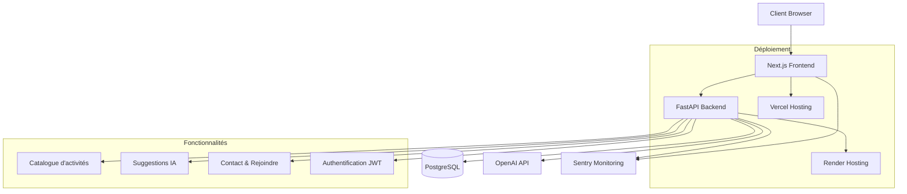

# La Vida Luca - Documentation

## Vue d'ensemble
La Vida Luca est une plateforme collaborative dédiée à la formation des jeunes en MFR (Maisons Familiales Rurales) et au développement d'une agriculture nouvelle. Cette documentation couvre l'architecture technique, le déploiement et l'utilisation de la plateforme.

## Architecture

### Composants
- **Frontend**: Next.js + React + TypeScript
- **Backend**: FastAPI + Python
- **Base de données**: PostgreSQL
- **Authentification**: JWT 
- **IA**: OpenAI integration
- **Déploiement**: Vercel (frontend) + Render (backend)
- **Monitoring**: Sentry (erreurs) + métriques personnalisées

### Schéma d'architecture


## Installation

### Prérequis
- Node.js 18.x ou supérieur
- Python 3.11+
- PostgreSQL 12+
- npm ou yarn
- Git

### 1. Cloner le repository
```bash
git clone https://github.com/vidaluca77-cloud/LaVidaLuca-App.git
cd LaVidaLuca-App
```

### 2. Installation complète
```bash
# Installation frontend et backend
npm run setup

# Ou installation séparée:
npm install                    # Frontend
npm run backend:install       # Backend
```

### 3. Configuration Backend
```bash
cd apps/backend
cp .env.example .env
# Éditer .env avec vos valeurs
```

### 4. Configuration Base de données
```bash
# Créer la base de données
createdb lavidaluca_dev

# Appliquer les migrations
npm run backend:migrate

# (Optionnel) Peupler avec des données d'exemple
cd apps/backend && python seed.py
```

### 5. Configuration Frontend
Créer un fichier `.env.local` à la racine avec les variables suivantes :
```env
# Backend API
NEXT_PUBLIC_API_URL=http://localhost:8000

# Backend API
NEXT_PUBLIC_API_URL=http://localhost:8000

# Sentry (monitoring - requis pour la surveillance des erreurs)
NEXT_PUBLIC_SENTRY_DSN=votre_dsn_sentry

# Sentry Backend (pour le monitoring backend)
SENTRY_DSN=votre_dsn_sentry_backend

# Contact
NEXT_PUBLIC_CONTACT_EMAIL=contact@lavidaluca.fr
NEXT_PUBLIC_CONTACT_PHONE=+33123456789
```

### 6. Lancement en développement
```bash
# Frontend seul
npm run dev

# Backend seul  
npm run backend:dev

# Frontend + Backend simultanément
npm run dev:full
```

L'application sera accessible sur :
- **Frontend**: `http://localhost:3000`
- **Backend API**: `http://localhost:8000`
- **Documentation API**: `http://localhost:8000/docs`
- **Monitoring Dashboard**: `http://localhost:3000/monitoring` (développement uniquement)
- **Métriques Prometheus**: `http://localhost:8000/metrics`

## Scripts disponibles

### Frontend
| Script | Description |
|--------|-------------|
| `npm run dev` | Lance le serveur de développement frontend |
| `npm run build` | Compile l'application pour la production |
| `npm run start` | Lance l'application compilée |
| `npm run lint` | Vérifie la qualité du code |
| `npm run type-check` | Vérifie les types TypeScript |
| `npm test` | Lance les tests frontend |

### Backend
| Script | Description |
|--------|-------------|
| `npm run backend:dev` | Lance le serveur de développement backend |
| `npm run backend:install` | Installe les dépendances Python |
| `npm run backend:test` | Lance les tests backend |
| `npm run backend:migrate` | Applique les migrations de base de données |
| `npm run backend:migration` | Crée une nouvelle migration |

### Full-stack
| Script | Description |
|--------|-------------|
| `npm run setup` | Installation complète (frontend + backend) |
| `npm run dev:full` | Lance frontend et backend simultanément |

## Structure du projet

```
├── apps/
│   ├── backend/            # API FastAPI
│   │   ├── main.py         # Point d'entrée de l'API
│   │   ├── config.py       # Configuration
│   │   ├── database.py     # Connexion base de données
│   │   ├── auth/           # Authentification JWT
│   │   ├── models/         # Modèles SQLAlchemy
│   │   ├── schemas/        # Schémas Pydantic
│   │   ├── routes/         # Points de terminaison API
│   │   ├── services/       # Logique métier
│   │   ├── migrations/     # Migrations Alembic
│   │   └── tests/          # Tests backend
│   └── web/                # Application frontend Next.js
├── public/                 # Fichiers statiques
│   ├── icons/             # Icônes PWA
│   └── manifest.webmanifest
├── src/
│   ├── app/               # App Router Next.js 13+
│   │   ├── api/           # Routes API (legacy)
│   │   ├── catalogue/     # Page catalogue d'activités
│   │   ├── contact/       # Page contact
│   │   ├── rejoindre/     # Page rejoindre
│   │   ├── layout.tsx     # Layout principal
│   │   └── page.tsx       # Page d'accueil
│   ├── components/        # Composants réutilisables
│   ├── lib/              # Utilitaires et configurations
│   ├── monitoring/       # Outils de monitoring
│   └── types/            # Types TypeScript
├── monitoring/            # Configuration monitoring backend
├── docs/                 # Documentation additionnelle
└── tests/                # Tests frontend
```

## Déploiement

### Production sur Vercel

1. **Connexion du repository**
   - Connecter le repository GitHub à Vercel
   - Sélectionner la branche `main` pour les déploiements automatiques

2. **Configuration des variables d'environnement**
   Dans le dashboard Vercel, ajouter toutes les variables du fichier `.env.local`

3. **Déploiement**
   ```bash
   # Déploiement automatique via Git
   git push origin main
   
   # Ou déploiement manuel via CLI
   npx vercel --prod
   ```

### Optimisations de production
- **Compression** : Gzip automatique
- **Images** : Optimisation via Next.js
- **Fonts** : Optimisation automatique des Google Fonts
- **Bundle** : Tree-shaking et minification
- **PWA** : Manifest et service worker

## Monitoring et Observabilité

### Sentry (Monitoring d'erreurs)
- Capture automatique des erreurs frontend
- Monitoring des performances
- Alertes en temps réel
- Session Replay pour le debugging

### Métriques personnalisées
- Temps de chargement des pages
- Interactions utilisateur
- Erreurs API
- Performances des suggestions IA

### Logs structurés
```javascript
// Exemple d'utilisation
import { logger } from '@/lib/logger';

logger.info('Action utilisateur', {
  action: 'view_activity',
  activityId: 'abc123',
  userId: 'user456'
});
```

## API et Intégrations

### Routes API principales
- `GET /api/activities` - Liste des activités
- `POST /api/contact` - Envoi de messages de contact
- `GET /api/suggestions` - Suggestions IA personnalisées

### Intégrations externes
- **Supabase** : Base de données et authentification
- **OpenAI** : Génération de suggestions personnalisées
- **Sentry** : Monitoring et alertes

## Tests

### Exécution des tests
```bash
# Tests unitaires
npm test

# Tests avec coverage
npm run test:coverage

# Tests en mode watch
npm run test:watch
```

### Types de tests
- **Unitaires** : Composants et fonctions utilitaires
- **Intégration** : Flux utilisateur complets
- **E2E** : Tests de bout en bout avec Playwright

## Contribution

### Workflow de développement
1. **Fork** du repository
2. **Branche** : `git checkout -b feature/ma-fonctionnalite`
3. **Développement** avec tests
4. **Commit** : `git commit -m 'feat: ajouter ma fonctionnalité'`
5. **Push** : `git push origin feature/ma-fonctionnalite`
6. **Pull Request** avec description détaillée

### Standards de code
- **ESLint** : Configuration stricte Next.js
- **TypeScript** : Typage strict activé
- **Prettier** : Formatage automatique
- **Conventional Commits** : Messages de commit standardisés

### Review checklist
- [ ] Tests passent (`npm test`)
- [ ] Build réussit (`npm run build`)
- [ ] Lint sans erreur (`npm run lint`)
- [ ] Types corrects (`npm run type-check`)
- [ ] Documentation mise à jour
- [ ] Changements testés manuellement

## Sécurité

### Bonnes pratiques
- Variables d'environnement pour les secrets
- Validation des inputs côté client et serveur
- CSP (Content Security Policy) configuré
- HTTPS obligatoire en production

### Authentification
- JWT tokens via Supabase
- Refresh tokens automatiques
- Logout sécurisé

## Monitoring et Observabilité

### Surveillance des erreurs
- **Sentry** : Capture et suivi des erreurs frontend et backend
- **Error Boundaries** : Gestion des erreurs React avec fallback UI
- **Filtrage intelligent** : Les erreurs sensibles sont automatiquement filtrées
- **Contexte utilisateur** : Tracking des actions utilisateur pour debugging

### Métriques de performance
- **Web Vitals** : FCP, LCP, FID, CLS en temps réel
- **API Performance** : Latence, taux de succès/échec des appels API
- **Métriques système** : CPU, mémoire, connexions base de données
- **Métriques métier** : Actions utilisateur, utilisation des fonctionnalités

### Dashboard de monitoring
- **Interface temps réel** : `/monitoring` (développement uniquement)
- **Statut de santé** : Aperçu global de l'état de l'application
- **Alertes** : Système d'alertes configurables pour les problèmes critiques
- **Export des données** : Téléchargement des métriques au format JSON

### Logging structuré
- **Frontend** : JSON structuré avec contexte utilisateur
- **Backend** : Logs contextuels avec request ID unique
- **Activités utilisateur** : Tracking des interactions pour analytics
- **API calls** : Log complet des requêtes/réponses avec durée

### Configuration monitoring
```bash
# Frontend (.env.local)
NEXT_PUBLIC_SENTRY_DSN=your_sentry_dsn

# Backend (.env)
SENTRY_DSN=your_sentry_backend_dsn
```

### Endpoints de monitoring
- **Health check** : `GET /health`
- **Métriques Prometheus** : `GET /metrics`
- **Dashboard monitoring** : `http://localhost:3000/monitoring`

## Performance

### Optimisations
- **Code splitting** automatique par Next.js
- **Lazy loading** des composants
- **Image optimization** avec next/image
- **Font optimization** avec next/font

### Métriques cibles
- **FCP** < 1.5s (First Contentful Paint)
- **LCP** < 2.5s (Largest Contentful Paint)
- **CLS** < 0.1 (Cumulative Layout Shift)
- **FID** < 100ms (First Input Delay)

## Support et Contact

### Documentation
- **API Docs** : `/docs` (à venir avec backend)
- **Storybook** : Composants UI (à venir)
- **Wiki** : Documentation étendue

### Contact technique
- **Email** : tech@lavidaluca.fr
- **Issues** : GitHub Issues pour les bugs
- **Discussions** : GitHub Discussions pour les questions

## Roadmap

### À venir
- [ ] Backend FastAPI pour l'IA
- [ ] Authentification complète
- [ ] Dashboard utilisateur
- [ ] Mobile app (React Native)
- [ ] API publique
- [ ] Intégration calendrier
- [ ] Notifications push

---

**La Vida Luca** - Plateforme collaborative pour la formation des jeunes en MFR et le développement d'une agriculture nouvelle.

*Dernière mise à jour : 2024*