# La Vida Luca - Documentation

## Vue d'ensemble

La Vida Luca est une plateforme collaborative dédiée à la formation des jeunes en MFR (Maisons Familiales Rurales) et au développement d'une agriculture nouvelle. Cette documentation couvre l'architecture technique, le déploiement et l'utilisation de la plateforme.

## 🚀 Démarrage rapide

### Prérequis

- Node.js 18.x ou supérieur
- npm ou yarn
- Git

### Installation

```bash
# Cloner le projet
git clone https://github.com/vidaluca77-cloud/LaVidaLuca-App.git
cd LaVidaLuca-App

# Installer les dépendances
npm install

# Lancer le serveur de développement
npm run dev
```

L'application sera accessible sur [http://localhost:3000](http://localhost:3000).

## 📁 Structure du projet

```
src/
├── app/                    # Next.js App Router (pages et API routes)
│   ├── api/               # API routes
│   ├── catalogue/         # Page catalogue des activités
│   ├── contact/           # Page de contact
│   ├── rejoindre/         # Page rejoindre l'aventure
│   ├── globals.css        # Styles globaux
│   ├── layout.tsx         # Layout principal
│   ├── page.tsx           # Page d'accueil
│   └── sitemap.ts         # Génération du sitemap
├── components/            # Composants React réutilisables
│   ├── __tests__/         # Tests des composants
│   ├── ActivityCard.tsx   # Carte d'activité
│   ├── Button.tsx         # Composant bouton
│   ├── Header.tsx         # En-tête de l'application
│   ├── MissionCard.tsx    # Carte de mission
│   └── index.ts           # Exports des composants
├── hooks/                 # Custom React hooks
│   ├── useActivityMatching.ts  # Hook pour matching d'activités
│   ├── useUserProfile.ts      # Hook pour gestion profil utilisateur
│   └── index.ts          # Exports des hooks
├── lib/                  # Utilitaires et helpers
│   └── logger.ts         # Système de logging
├── monitoring/           # Monitoring et métriques
│   ├── alerts.ts         # Gestion des alertes
│   ├── dashboard.ts      # Dashboard de monitoring
│   └── performance.ts    # Monitoring des performances
├── tests/               # Tests unitaires
│   ├── docs/            # Tests de documentation
│   └── monitoring/      # Tests de monitoring
└── types/               # Définitions TypeScript
    └── index.ts         # Types principaux
```

## 🛠️ Scripts disponibles

```bash
# Développement
npm run dev              # Serveur de développement
npm run build           # Build de production
npm run start           # Serveur de production

# Tests
npm test                # Tests unitaires
npm run test:coverage   # Tests avec couverture
npm run test:watch      # Tests en mode watch

# Qualité de code
npm run lint            # Linting ESLint
npm run lint:fix        # Fix automatique ESLint
npm run format          # Formatage Prettier
npm run format:check    # Vérification formatage
npm run type-check      # Vérification TypeScript
```

## 🧪 Tests

Le projet utilise Jest et React Testing Library pour les tests unitaires.

### Lancer les tests

```bash
# Tous les tests
npm test

# Tests avec couverture
npm run test:coverage

# Tests en mode watch
npm run test:watch

# Tests d'un composant spécifique
npm test -- --testPathPatterns="Button"
```

### Structure des tests

- `src/components/__tests__/` : Tests des composants React
- `src/tests/` : Tests des utilitaires et services
- `jest.config.js` : Configuration Jest
- `jest.setup.js` : Configuration globale des tests

## 📦 Technologies utilisées

### Frontend

- **Next.js 15.4.7** - Framework React avec App Router
- **React 18.x** - Bibliothèque UI
- **TypeScript** - Typage statique
- **Tailwind CSS** - Framework CSS utilitaire

### Outils de développement

- **ESLint** - Linting JavaScript/TypeScript
- **Prettier** - Formatage de code
- **Jest** - Framework de tests
- **React Testing Library** - Tests de composants React
- **Husky** - Git hooks
- **lint-staged** - Linting des fichiers stagés

### Monitoring

- **Sentry** - Monitoring d'erreurs
- **Métriques personnalisées** - Monitoring des performances

## 🚀 Déploiement

### Build de production

```bash
npm run build
npm start
```

### Variables d'environnement

Créer un fichier `.env.local` :

```env
NEXT_PUBLIC_SENTRY_DSN=your_sentry_dsn
# Autres variables selon les besoins
```

### Déploiement sur Vercel

Le projet est configuré pour être déployé automatiquement sur Vercel lors des push sur la branche `main`.

## 🔧 Configuration

### ESLint

Configuration dans `.eslintrc.json` avec les règles Next.js recommandées.

### Prettier

Configuration dans `.prettierrc` pour un formatage cohérent.

### TypeScript

Configuration dans `tsconfig.json` avec support des path mappings (`@/*`).

### Husky

Pre-commit hooks configurés pour :

- Linting automatique
- Formatage automatique
- Vérification des types

## 🤝 Contribution

1. Fork le projet
2. Créer une branche feature (`git checkout -b feature/amazing-feature`)
3. Commit les changements (`git commit -m 'Add amazing feature'`)
4. Push vers la branche (`git push origin feature/amazing-feature`)
5. Ouvrir une Pull Request

### Standards de code

- Utiliser TypeScript pour tous les nouveaux fichiers
- Ajouter des tests pour les nouveaux composants
- Suivre les conventions de nommage existantes
- Documenter les fonctions complexes avec JSDoc

## 📋 Roadmap

- [ ] Intégration base de données Supabase
- [ ] Authentification utilisateur
- [ ] Interface d'administration
- [ ] API REST complète
- [ ] Tests end-to-end avec Playwright
- [ ] Optimisations performances
- [ ] Mode hors ligne (PWA)

## 📄 Licence

Ce projet est sous licence [MIT](LICENSE).

## 📞 Contact

- **Email**: vidaluca77@gmail.com
- **Snapchat**: @lavidaluca77

---

## Architecture

### Composants

- **Frontend**: Next.js + React + TypeScript
- **Base de données**: PostgreSQL (Supabase)
- **Authentification**: JWT via Supabase
- **Déploiement**: Vercel (frontend)
- **Monitoring**: Sentry (erreurs) + métriques personnalisées

### Schéma d'architecture

```mermaid
graph TB
    Client[Client Browser] --> Frontend[Next.js Frontend]
    Frontend --> Supabase[(Supabase PostgreSQL)]
    Frontend --> Sentry[Sentry Monitoring]
    Frontend --> OpenAI[OpenAI API]

    subgraph "Déploiement"
        Frontend --> Vercel[Vercel Hosting]
    end

    subgraph "Fonctionnalités"
        Frontend --> Activities[Catalogue d'activités]
        Frontend --> IA[Suggestions IA]
        Frontend --> Contact[Contact & Rejoindre]
    end
```



## Installation

### Prérequis

- Node.js 18.x ou supérieur
- npm ou yarn
- Git

### 1. Cloner le repository

```bash
git clone https://github.com/vidaluca77-cloud/LaVidaLuca-App.git
cd LaVidaLuca-App
```

### 2. Installation des dépendances

```bash
npm install
```

### 3. Configuration de l'environnement

Créer un fichier `.env.local` avec les variables suivantes :

```env
# Supabase
NEXT_PUBLIC_SUPABASE_URL=votre_url_supabase
NEXT_PUBLIC_SUPABASE_ANON_KEY=votre_clé_supabase

# OpenAI (pour les suggestions IA)
OPENAI_API_KEY=votre_clé_openai

# Sentry (monitoring)
NEXT_PUBLIC_SENTRY_DSN=votre_dsn_sentry

# Contact
NEXT_PUBLIC_CONTACT_EMAIL=contact@lavidaluca.fr
NEXT_PUBLIC_CONTACT_PHONE=+33123456789
```

### 4. Lancement en développement

```bash
npm run dev
```

L'application sera accessible sur `http://localhost:3000`

## Scripts disponibles

| Script               | Description                              |
| -------------------- | ---------------------------------------- |
| `npm run dev`        | Lance le serveur de développement        |
| `npm run build`      | Compile l'application pour la production |
| `npm run start`      | Lance l'application compilée             |
| `npm run lint`       | Vérifie la qualité du code               |
| `npm run type-check` | Vérifie les types TypeScript             |

## Structure du projet

```
├── public/                 # Fichiers statiques
│   ├── icons/             # Icônes PWA
│   └── manifest.webmanifest
├── src/
│   ├── app/               # App Router Next.js 13+
│   │   ├── api/           # Routes API
│   │   ├── catalogue/     # Page catalogue d'activités
│   │   ├── contact/       # Page contact
│   │   ├── rejoindre/     # Page rejoindre
│   │   ├── layout.tsx     # Layout principal
│   │   └── page.tsx       # Page d'accueil
│   ├── components/        # Composants réutilisables
│   ├── lib/              # Utilitaires et configurations
│   ├── monitoring/       # Outils de monitoring
│   └── types/            # Types TypeScript
├── monitoring/            # Configuration monitoring backend
├── docs/                 # Documentation additionnelle
└── tests/                # Tests
```

## Déploiement

### Production sur Vercel

1. **Connexion du repository**
   - Connecter le repository GitHub à Vercel
   - Sélectionner la branche `main` pour les déploiements automatiques

2. **Configuration des variables d'environnement**
   Dans le dashboard Vercel, ajouter toutes les variables du fichier `.env.local`

3. **Déploiement**

   ```bash
   # Déploiement automatique via Git
   git push origin main

   # Ou déploiement manuel via CLI
   npx vercel --prod
   ```

### Optimisations de production

- **Compression** : Gzip automatique
- **Images** : Optimisation via Next.js
- **Fonts** : Optimisation automatique des Google Fonts
- **Bundle** : Tree-shaking et minification
- **PWA** : Manifest et service worker

## Monitoring et Observabilité

### Sentry (Monitoring d'erreurs)

- Capture automatique des erreurs frontend
- Monitoring des performances
- Alertes en temps réel
- Session Replay pour le debugging

### Métriques personnalisées

- Temps de chargement des pages
- Interactions utilisateur
- Erreurs API
- Performances des suggestions IA

### Logs structurés

```javascript
// Exemple d'utilisation
import { logger } from '@/lib/logger';

logger.info('Action utilisateur', {
  action: 'view_activity',
  activityId: 'abc123',
  userId: 'user456',
});
```

## API et Intégrations

### Routes API principales

- `GET /api/activities` - Liste des activités
- `POST /api/contact` - Envoi de messages de contact
- `GET /api/suggestions` - Suggestions IA personnalisées

### Intégrations externes

- **Supabase** : Base de données et authentification
- **OpenAI** : Génération de suggestions personnalisées
- **Sentry** : Monitoring et alertes

## Tests

### Exécution des tests

```bash
# Tests unitaires
npm test

# Tests avec coverage
npm run test:coverage

# Tests en mode watch
npm run test:watch
```

### Types de tests

- **Unitaires** : Composants et fonctions utilitaires
- **Intégration** : Flux utilisateur complets
- **E2E** : Tests de bout en bout avec Playwright

## Contribution

### Workflow de développement

1. **Fork** du repository
2. **Branche** : `git checkout -b feature/ma-fonctionnalite`
3. **Développement** avec tests
4. **Commit** : `git commit -m 'feat: ajouter ma fonctionnalité'`
5. **Push** : `git push origin feature/ma-fonctionnalite`
6. **Pull Request** avec description détaillée

### Standards de code

- **ESLint** : Configuration stricte Next.js
- **TypeScript** : Typage strict activé
- **Prettier** : Formatage automatique
- **Conventional Commits** : Messages de commit standardisés

### Review checklist

- [ ] Tests passent (`npm test`)
- [ ] Build réussit (`npm run build`)
- [ ] Lint sans erreur (`npm run lint`)
- [ ] Types corrects (`npm run type-check`)
- [ ] Documentation mise à jour
- [ ] Changements testés manuellement

## Sécurité

### Bonnes pratiques

- Variables d'environnement pour les secrets
- Validation des inputs côté client et serveur
- CSP (Content Security Policy) configuré
- HTTPS obligatoire en production

### Authentification

- JWT tokens via Supabase
- Refresh tokens automatiques
- Logout sécurisé

## Performance

### Optimisations

- **Code splitting** automatique par Next.js
- **Lazy loading** des composants
- **Image optimization** avec next/image
- **Font optimization** avec next/font

### Métriques cibles

- **FCP** < 1.5s (First Contentful Paint)
- **LCP** < 2.5s (Largest Contentful Paint)
- **CLS** < 0.1 (Cumulative Layout Shift)
- **FID** < 100ms (First Input Delay)

## Support et Contact

### Documentation

- **API Docs** : `/docs` (à venir avec backend)
- **Storybook** : Composants UI (à venir)
- **Wiki** : Documentation étendue

### Contact technique

- **Email** : tech@lavidaluca.fr
- **Issues** : GitHub Issues pour les bugs
- **Discussions** : GitHub Discussions pour les questions

## Roadmap

### À venir

- [ ] Backend FastAPI pour l'IA
- [ ] Authentification complète
- [ ] Dashboard utilisateur
- [ ] Mobile app (React Native)
- [ ] API publique
- [ ] Intégration calendrier
- [ ] Notifications push

---

**La Vida Luca** - Plateforme collaborative pour la formation des jeunes en MFR et le développement d'une agriculture nouvelle.

_Dernière mise à jour : 2024_
