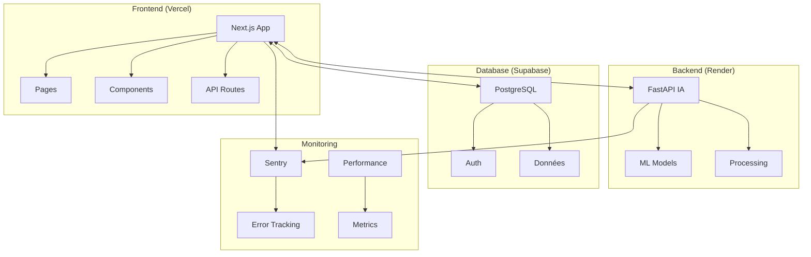

# Architecture La Vida Luca

## Vue d'ensemble

La plateforme La Vida Luca est construite sur une architecture moderne et modulaire utilisant Next.js pour le frontend et FastAPI pour l'API backend d'IA.

## Diagramme d'architecture

## Composants principaux

### Frontend (Next.js)
- **Technology**: Next.js 14 with App Router
- **Hosting**: Vercel
- **Features**: 
  - Static Site Generation (SSG)
  - Server Components
  - TypeScript
  - Tailwind CSS

### Backend IA (FastAPI)
- **Technology**: Python FastAPI
- **Hosting**: Render
- **Features**:
  - API REST pour l'IA
  - Traitement des recommandations
  - Gestion des profils utilisateurs

### Base de données (Supabase)
- **Technology**: PostgreSQL + Auth
- **Hosting**: Supabase Cloud
- **Features**:
  - Authentification
  - Base de données relationnelle
  - API temps réel

## Flux de données

1. L'utilisateur interagit avec l'interface Next.js
2. Les requêtes sont routées vers les APIs appropriées
3. L'IA traite les demandes de recommandations
4. Les données sont stockées/récupérées depuis Supabase
5. Les résultats sont affichés dans l'interface

## Sécurité

- HTTPS pour tous les échanges
- Authentification via Supabase Auth
- Variables d'environnement pour les secrets
- CORS configuré pour les domaines autorisés

## Performance

- Génération statique des pages
- Images optimisées
- Code splitting automatique
- Cache navigateur